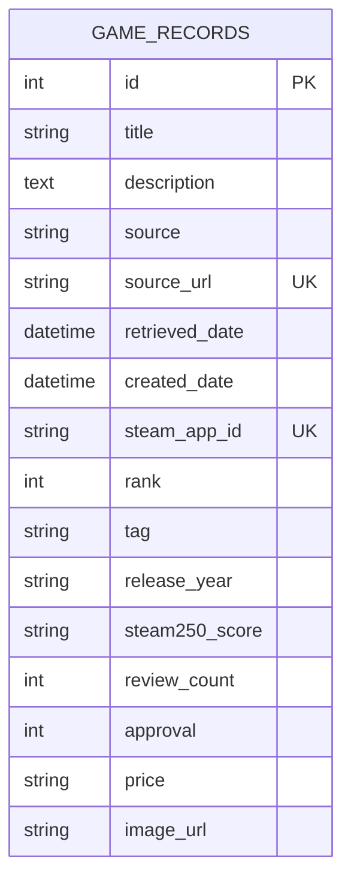

# GameScope ERD

One standalone `game_records` table stores Steam 250 discoveries and manually managed game records. No relationships are defined in the current schema.

```mermaid
erDiagram
  GAME_RECORDS {
    int id PK
    string title
    text description
    string source
    string source_url UK
    datetime retrieved_date
    datetime created_date
    string steam_app_id UK
    int rank
    string tag
    string release_year
    string steam250_score
    int review_count
    int approval
    string price
    string image_url
  }
```
